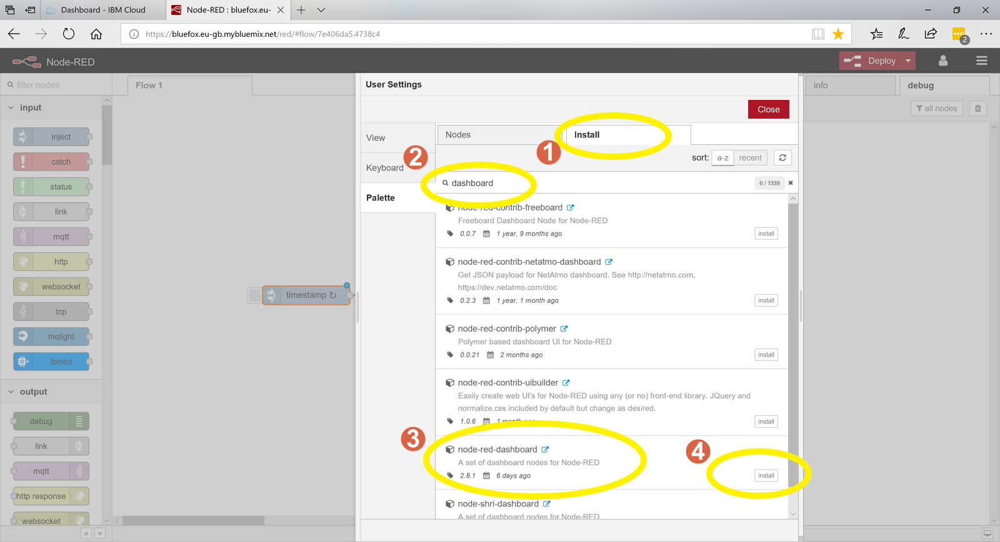
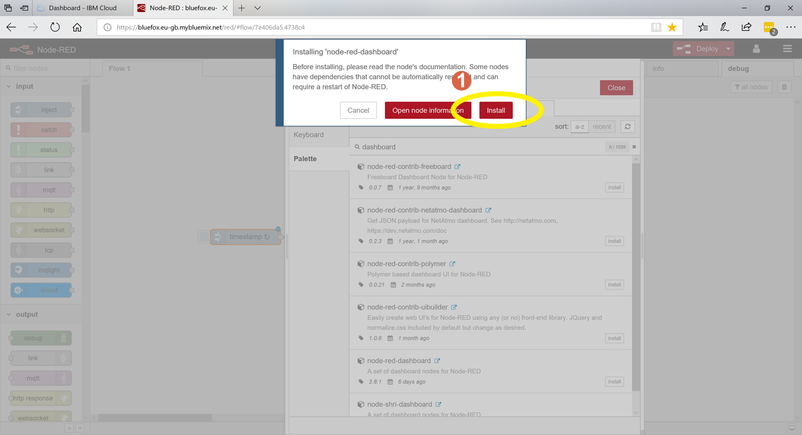
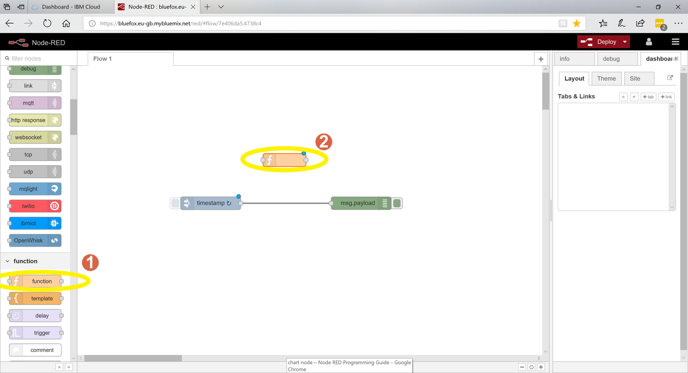
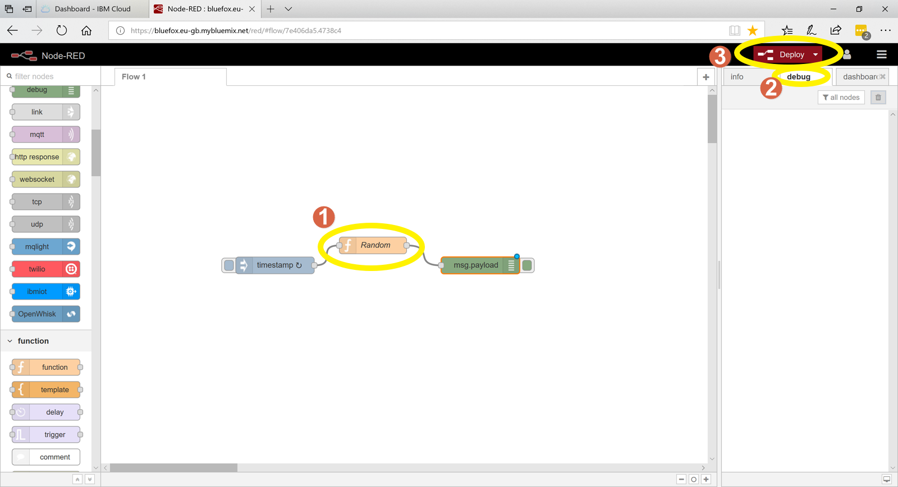
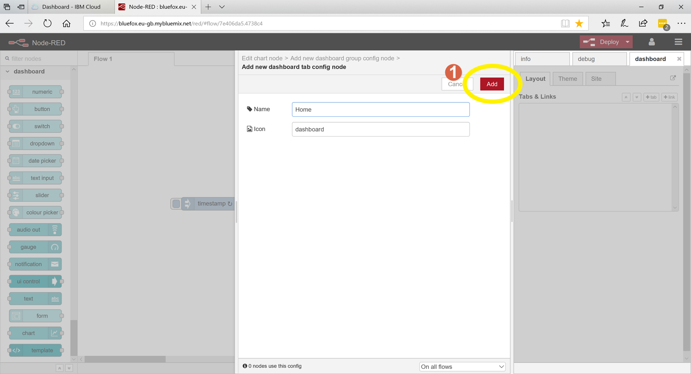

# Node-RED-Simple-Example

- Nodes can be dragged from the toolbar on the left onto the graph paper in the middle where they can then be used. Nodes can be connected together by dragging the connection points on them from one node to another. Nodes configuration screens are opend by double cicking on them. Lets try these things.

1. Drag an inject node from the toolbar onto the working area.
2. Drag a debug node from the tollbar onto the working area.
3. Connect the nodes together by dragging the connection point (small circle) from one node to the connection point of the other.
4. Click on the DEBUG tab on the right hand side. This will select an area where we can see the output of the DEBUG node
5. Deploy the application, basically this saves the application and runs it.
6. Click on this part of the node to inject a timestamp (number that represents the time) into the DEBUG node. We can now see this number appear on the right hand side each time we press the button.

- OK we are now going to try something a little more complicated we are going to get the inject node to automatically inject a time stamp every second so we dont have to keep pressing the button.

1. Double click on the timestamp inject node to open its configuration screen.
2. Select Inject on or after 0.1 seconds this starts the inject node as soon as we deploy the application.
3. Set the repeat option to interval.
4. Set the interval to 1 second.
5. Save and close the configuration screen by clicking done.

1. Click on Deploy to save and run the application you will now see a timestamp appear in the DEBUG window every second. You will also notice the timestamp increases by one each time it is displayed. 

