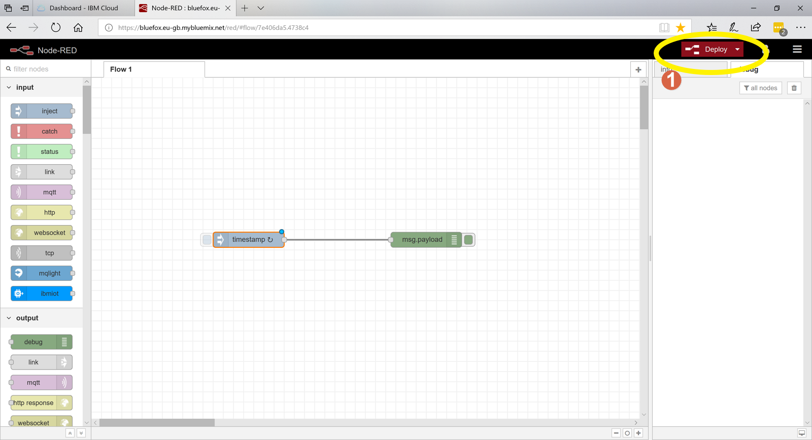
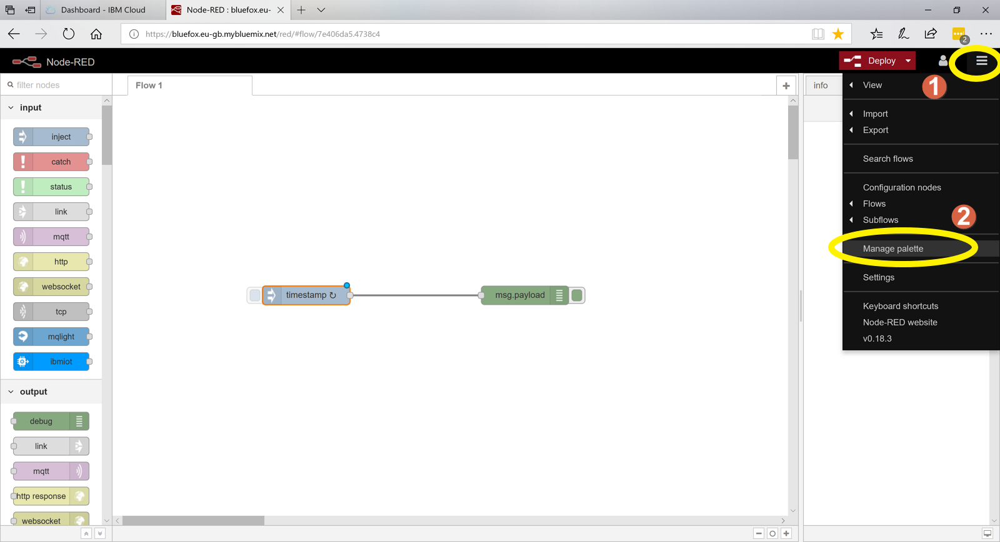
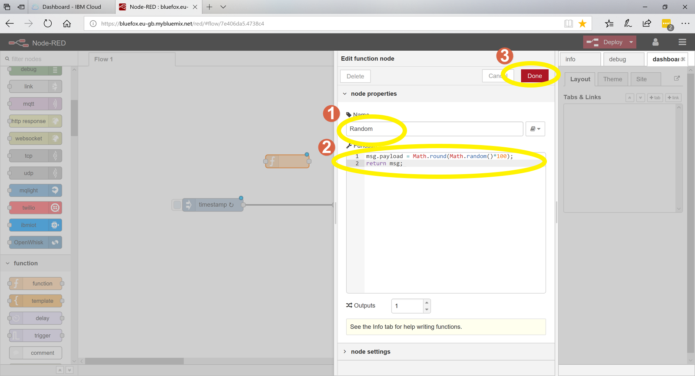
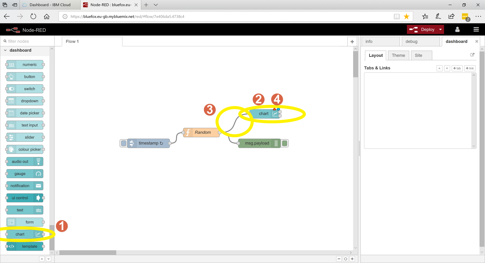

# Node-RED-Simple-Example

This is a simple example of how to write a Node-RED application a few basics on how to use the UI are bulleted below.

- Nodes can be dragged from the toolbar on the left onto the graph paper in the middle where they can then be used. 
- Nodes can be connected together by dragging the connection points on them from one node to another. 
- Node configuration screens are opened by double cicking on them. 

Lets try!

1. Drag an inject node from the toolbar onto the working area.
2. Drag a debug node from the tollbar onto the working area.
3. Connect the nodes together by dragging the connection point (small circle) from one node to the connection point of the other.
4. Click on the DEBUG tab on the right hand side. This will select an area where we can see the output of the DEBUG node
5. Deploy the application, basically this saves the application and runs it.
6. Click on this part of the node to inject a timestamp (number that represents the time) into the DEBUG node. We can now see this number appear on the right hand side each time we press the button.


OK we are now going to try something a little more complicated we are going to get the inject node to automatically inject a time stamp every second so we dont have to keep pressing the button.

1. Double click on the timestamp inject node to open its configuration screen.
2. Select Inject on or after 0.1 seconds this starts the inject node as soon as we deploy the application.
3. Set the repeat option to interval.
4. Set the interval to 1 second.
5. Save and close the configuration screen by clicking done.


1. Click on Deploy to save and run the application you will now see a timestamp appear in the DEBUG window every second. You will also notice the timestamp increases by one each time it is displayed. 



We will now install some new nodes once installed they will appear in the toolbar on the left. To see them you will need to scroll all the way down to the bottom. First lets install them.

1. Click the menu select icon at the top right of the screen
2. Select 'Manage Pallette' the pallette configuration screen should open.



1. Click on the INSTALL Tab this brings up a list of the avaliable nodes you can install. 
2. In the search box type dashboard and it will search all nodes associated with dashboards
3. Find node-red-dashboard in the list.
4. Click install and wait for the installation to complete.


1. You may get a warning message, click install as the required dependencies are present.


1. Evantually after a number of messages are shown on the screen this button should indicate that the dashboard nodes are installed.
2. Close the palette configuration screen.

- The dashboard nodes should now be installed you can check by looking for them in the toolbar on the left. You will have to scroll all the way down to the bottom to see them. We will be using the chart node soon to display a chart on the UI but first we need to create some data for the chart to display.


1. Find the function node in the toolbar
2. Drag a function node onto the workspace.


1. Type Random as the name for the node. We are going to use this node to generate a random number.
2. In the function area replace what is there with the code below. It should look like the picture.

```
msg.payload = Math.round(Math.random()*100);
return msg;
```
3. Once completed click on Done to save changes to the node



1. We now need to insert this function node between the timestamp inject node and the debug node you can do this by dragging the random function node over the line between the two other nodes. It should insert itself between them.
2. Now click on the debug tab to ensure we see the debug output from the debug node.
3. Click on 'Deploy' t save and run the application and observe the output in the debug window. This should be dsplaying a random number between 0 and 100 every second.


1. We now have the data to display in our chart so lets find a chart node on the toolbar on the left, dont forget to scroll down.
2. Drag the chart node onto the workspace
3. Connect the output of the random function to the input of the chart node
4. Double click the chart node to open the configuration screen.




1. Click on the pencil next to the Add UI Group text box


1. Click and drag the with until it is 18 this changes the size of the area we can display the graph in.
2. Click on the pencil next to the TAB dropdown box 


1. Click on Add this adds the name of the tab the graph will be displayed under in the UI.


1. Click on Add to save changes


- We are now going to configure the chart so it will look a lot prettier when it displays 

1. Change the Size to 18x6 
2. Change the X axis to only display the last minutes data.
3. Change interpolate to bezier
4. Click done to save the chart configuration
5. Click deploy to save the application and run it
6. Click on the dashboard tab 
7. Clck on the little screen with an arrow to display the dashboard


Congratuations you should now have a real time chart displaying your random data. Next we can look at collecting data from a sensor via the sigfox LPWAN network and displaying that instead.


